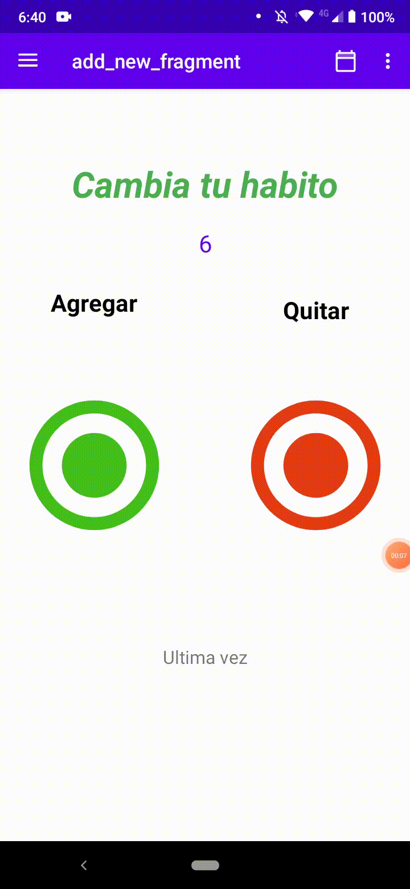
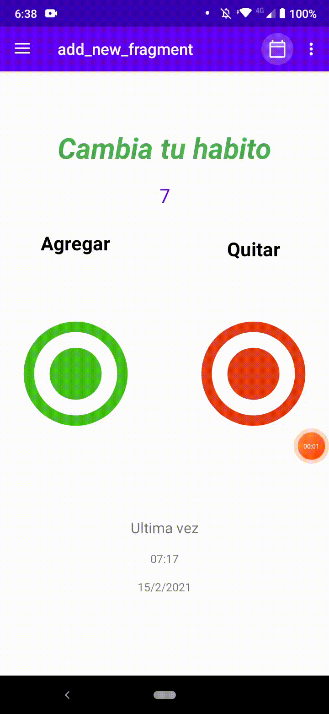

# Cambia tu habito

Esta es una aplicación que permite llevar la cuenta de un habito que quieres comenzar a tener o un habito que quieres cambiar

## Tecnologia aplicada

MVVM: arquitectura.  
Room: Base de datos local.  
Corutines: corutinas para manejar ejecucion de codigo asincrono. 
Navigation: navegacion entre fragments.  
DataBinding: Union entre componentes layout y controladores.  
SharePreferences: Almacena datos de poco tamaño que persisten en la aplicacion  

## Aplicación

Navegacion menu y drawer.

Juega y gana.

## License

Application developed by Miguel Angel Bello Garcia, github @miguelmabellog
